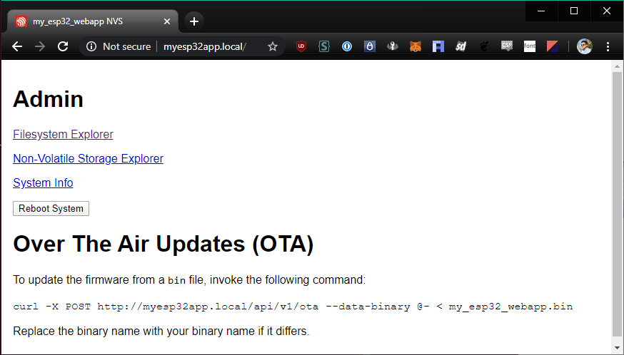
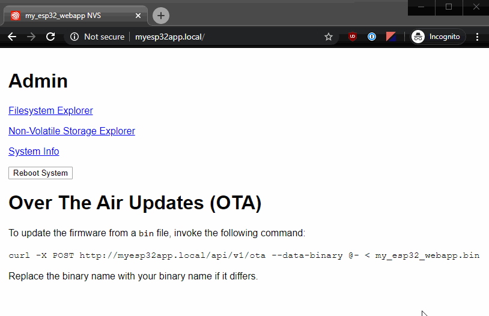
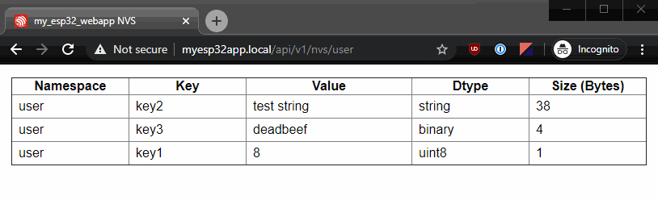

This is a [cookiecutter](https://github.com/cookiecutter/cookiecutter) template 
for anyone who wants to create an ESP32 application with webserver capabilities
(including serving a simple REST API).

# Usage
To render this template into a working project directory, you need to use the
command-line utility `cookiecutter`. This can be installed via `pip3 install cookiecutter`.

```
cookiecutter -c v0.0.0 git@github.com:BrianPugh/cookiecutter-esp32-webserver.git
```

## Routes

Add new source files containing route handlers to `src/route/v1/*`. 
Make sure to also add these files to `src/CMakeLists.txt` otherwise they
will not be compiled.
As you make backwards incompatible updates to certain endpoints, 
you can create a new folder `v2` while maintaining older routes.

Adding routes involves 2 parts:

1. Writing the handler function (see `src/route/v1/examples.c`)
2. Registering the handler with a route and command type in the `register_routes`
   function of `src/route.c`.

Thats it!

# Additional Features



Features descrbied in this section are linked in the root route `/` for easy access.

For admin endpoints, if the request has `text/html` in the `ACCEPT` field of the
http header, then the server will respond with the webgui. Otherwise, JSON or
binary data will be returned.

## Admin Filesystem Interface



This project comes with a [port of LittleFS](https://github.com/joltwallet/esp_littlefs),
a small fail-safe filesystem with higher performance than SPIFFS. Also bundled
is a web-accessible file explorer to browse, upload, and delete files at 
`/api/v1/filesystem`.

File contents can be gathered by issuing `GET` to `/api/v1/filesystem/path/to/file`.

Folder contents can also be queried via a `GET` command. For example:

```
$ curl ${ESP32_IP}/api/v1/filesystem
{
    "contents":[
        {
            "name":"foo",
            "type":"dir",
            "size":0
        },
        {
            "name":"test.txt",
            "type":"file",
            "size":45
        }
    ]
}
```

## Admin Non-Volatile Storage Interface



NVS offers a convenient way to store key/value pairs to flash. The admin 
interface at `/api/v1/nvs` allows for viewing and modifying existing NVS
entries. Clicking away from an editted value will save the value to flash.

Values can be manually queried via `GET`:

```
$ curl ${ESP32_IP}/api/v1/nvs/user/key1
{
        "namespace":    "user",
        "key": 			"key1",
        "dtype":        "uint8",
        "value":        9,
        "size": 		1
}
```

Entire namespaces (or even the entire system) can also be queried. Binary data
will be converted into a hexidecimal representation.

```
$ curl ${ESP32_IP}/api/v1/nvs/user
{
	"contents":[
		{
            "namespace":"user",
            "key":"key2",
            "value":"test string",
            "dtype":"string",
            "size":12
        },
        {
            "namespace":"user",
            "key":"key1",
            "value":"9",
            "dtype":"uint8",
            "size":1
        },
        {
            "namespace":"user",
            "key":"key3",
            "value":"deadbeef",
            "dtype":"binary",
            "size":4
        }
    ]
}
```

Values can be manually updated via `POST`:

```
curl -X POST ${ESP32_IP}/api/v1/nvs/some_namespace --data '{"key1": 7}'
```

Multiple key/value pairs for a single namespace can be provided at once.


## OTA

New firmware can be flashed over wifi by sending a `POST` command to the 
`/api/v1/ota` endpoint like:

```
curl -X POST http://myesp32app.local/api/v1/ota --data-binary @- < my_esp32_webapp.bin
```

OTA has significant implications on how the ESP32 flash is partitioned.
See/Modify `partitions.csv` to suit your project's needs. Warning: if the 
uploaded firmware has a bug that prevents access to this endpoint, subsequent
firmware updates must be preferred via UART.

## System

Get system information by sending a `GET` command to `/api/v1/system/info`:

```
$ curl ${ESP32_IP}/api/v1/system/info
{
        "idf-version":  "v4.2-dev-1416-g34a92385d",
        "model":        "ESP32",
        "cores":        2,
        "silicon-revision":     1,
        "project-name": "my_esp32_webapp",
        "project-version":      "0.0.0",
        "compile-date": "May 14 2020",
        "compile-time": "09:23:07",
        "secure-version":       0,
        "app-elf-sha256":       "f6ef9c7e0e0c260994351f994b3a87114ad91b6a8c85cfa30dd9fc3045a2cc77"
}
```

Reboot the system by sending a `POST` command to `/api/v1/system/reboot`

```
curl -X POST ${ESP32_IP}/api/v1/system/reboot
```

## Git Repo

A small nicety is that this cookiecutter template will automatically intializes 
git in your newly created project.

## Demo

A small demo endpoint  at `/api/v1/led/timer` is provided to show a REST API 
controlling a physical object. Flash an led (the LED pin must be properly 
configured via `idf.py menuconfig` under `<my project name> Configuration` at 
the root level) for 1000 milliseconds by the following command.

```
curl -X POST ${ESP32_IP}/api/v1/led/timer --data '{"duration": 1000}'
```

# Design Decisions

Many of the Admin features could have been included in the form of another
esp-idf component. However, to keep it easier to tailor to varying needs,
the files are directly included in the project to allow easier modifications.

# Misc tips

If you are unfamiliar with working with C/esp-idf projects, this section is 
meant to help out simple oversights/issues.

## Undefined references
If everything compiles, but you are having undefined references at the end
during linking, its probably because your forgot to add the c-file to 
`src/CMakeLists.txt`.
